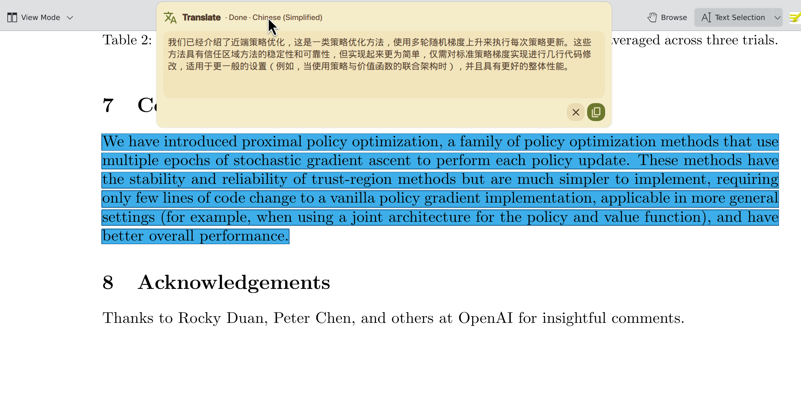
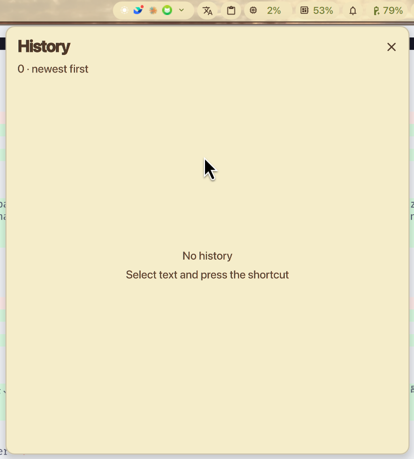

# Dank Translate AI

[English](README.md) | [简体中文](README.zh-CN.md)

面向安全设计的 DankMaterialShell 1.5+ 翻译插件。划词或复制后按一次快捷键，译文会流式显示在顶部中央的紧凑结果卡中，DankBar 同时保存从新到旧排列的翻译历史。





## 主要功能

- 单次读取：按下快捷键后才读取剪贴板与主选区
- 零剪贴板订阅、零轮询、零常驻监听进程
- 最近 60 秒内复制的文本优先；更早的剪贴板内容按空处理
- 连续快捷键会被合并；剪贴板与主选区快照均未变化时不会创建新请求
- 剪贴板文本进入接口前执行本地敏感信息检测
- 纯文本 MIME 白名单、文件与 URI 过滤、100,000 字符上限
- 支持任意 OpenAI 兼容云端接口或本地模型服务
- 自定义 API Key、Base URL、Endpoint、模型 ID、提示词和目标语言
- 支持 SSE 流式响应与完整 JSON 响应
- 顶部结果卡支持完整文本滚动、停止、关闭和复制
- DankBar 历史按时间从新到旧保存，支持复制、删除和清空
- 设置页支持中英双语、直接录入快捷键和重复检测

## 与现有翻译插件的定位差异

三个插件对应不同工作流。[DankTranslate](https://github.com/alcxyz/DankTranslate) 提供基于 `translate-shell` 的 Launcher 快速输入。[Glance Translate](https://github.com/ChaoXu1997/glance) 提供基于 `translate-shell` 的 DankBar 双栏编辑弹窗。Dank Translate AI 聚焦安全的快捷键 AI 翻译、流式输出、服务商无关接口配置和持久翻译历史。

| 项目 | DankTranslate | Glance Translate | Dank Translate AI |
|---|---|---|---|
| 主要流程 | 在 DMS Launcher 中输入触发符与文字 | 打开 DankBar 弹窗读取主选区或手动编辑 | 划词或最近复制后按一次快捷键 |
| 翻译后端 | `translate-shell` | `translate-shell` 与引擎回退 | 任意 OpenAI 兼容云端或本地模型 |
| 输出方式 | Launcher 结果 | 原文与译文双栏 | 顶部中央流式结果卡 |
| 可配置项 | 默认目标语言与语言代码前缀 | 翻译引擎与目标语言 | API Key、Base URL、Endpoint、模型、提示词、流式、超时和广泛语言列表 |
| 结果保存 | 选择结果后复制 | 原文与译文复制按钮 | DankBar 持久历史，最新结果优先 |
| 输入处理 | 用户显式输入 Launcher 文本 | 弹窗打开时读取主选区 | 单次时效判断、MIME 过滤、文件过滤、10 万字符上限和本地凭据检测 |

面向审核者的核心定位包括：AI 与本地模型支持、靠近原文上下文的流式结果、DankBar 翻译历史，以及注重隐私的单次输入管线。

## 输入与安全设计

`translateSelection` 每次调用仅执行下面一次流程：

1. 向本地 DMS 查询最新一条剪贴板元数据。
2. 优先选择最近 60 秒内复制的纯文本。
3. 其余情况读取当前 Wayland 鼠标主选区。
4. 对比当前来源与结果卡对应的两份输入快照。
5. 仅在剪贴板条目 ID 更新或主选区文本变化时创建请求。
6. 首次调用没有可用内容时提示“请先划词或复制文本”。

这套逻辑可以读取从 DMS 剪贴板历史重新复制的条目，也适配会把划词内容放进普通剪贴板的应用。插件不会订阅剪贴板事件。元数据查询、MIME 检查、大小检查和敏感信息检测均在本地完成，最终选中的原文才会进入所配置的翻译请求。

剪贴板检测覆盖密码管理器 MIME 标记、密码与密钥字段、私钥、认证头、JWT、常见服务商密钥格式、含凭据的连接地址、PIN、哈希和高熵混合字符串。检测采用偏保守策略，属于尽力而为的安全层。API Key 通过标准输入传给短生命周期适配器，进程参数中仅包含插件路径。

插件复制译文时会写入一个短期本地标记，下一次快捷键会避开插件自己的输出。

250 毫秒内的连续按键会合并处理。结果卡出现后，重复按快捷键会保持界面与请求不动，直到 DMS 剪贴板条目 ID 更新或主选区文字发生变化。再次复制相同文字也会生成新的条目 ID，因此可以重新翻译。

## 运行时与资源占用

插件目录包含 `pyproject.toml` 和 `uv.lock`。QML 直接运行目录内的标准库适配器：

```bash
uv run --project /path/to/dankTranslateAI --offline --frozen /path/to/dankTranslateAI/translate_stream.py
```

每次选区读取和翻译只创建短生命周期进程。完成、取消或超时后会释放 HTTP 响应、管道与子进程；流式内容逐行解析。插件没有常驻 Python 进程。

依赖：

- DankMaterialShell 1.5+
- `uv`
- `wl-clipboard` 提供的 `wl-paste`

翻译流程支持 DMS 覆盖的任意 Wayland 合成器，因此 Registry 使用 `"compositors": ["any"]` 与 `"distro": ["any"]`。设置页快捷键录入通过 DMS keybind 服务支持 Niri、Hyprland 与 MangoWC；其他合成器可使用下方 IPC 命令。

## 安装

```bash
cp -a dank-translate-ai ~/.config/DankMaterialShell/plugins/dankTranslateAI
```

随后：

1. 在 DMS 设置 → 插件中扫描并启用 **Dank Translate AI**。
2. 填写接口参数与目标语言。
3. 把插件加入 DankBar。
4. 点击“快捷键”右侧键盘图标并按下组合键；`Esc` 取消录入。

## 快捷键与 IPC

设置页写入下面的动作：

```bash
dms ipc call dankTranslateAI translateSelection
```

Niri 示例：

```kdl
Mod+Alt+T repeat=false hotkey-overlay-title="翻译划词或复制" {
    spawn "dms" "ipc" "call" "dankTranslateAI" "translateSelection";
}
```

其他 IPC：

```bash
# 读取最近 60 秒内复制的普通文本
dms ipc call dankTranslateAI translateClipboard

# 翻译调用者直接传入的文本
dms ipc call dankTranslateAI translateText "Hello, world!"

dms ipc call dankTranslateAI show
dms ipc call dankTranslateAI close
dms ipc call dankTranslateAI cancel
dms ipc call dankTranslateAI clearHistory
dms ipc call dankTranslateAI addToBar right
dms ipc call dankTranslateAI removeFromBar right
```

## 接口配置

插件发送 OpenAI Chat Completions 请求。设置页保持服务商无关，只填写所选云端接口或本地服务公开的参数。

默认本地示例：

```text
Base URL: http://127.0.0.1:8080/v1
Endpoint: /chat/completions
Model: tencent/Hy-MT2-1.8B-GGUF
```

DeepSeek 示例：

```text
Base URL: https://api.deepseek.com
Endpoint: /chat/completions
Model: deepseek-v4-flash
```

默认提示词使用 `${target_lang}`。目标语言列表覆盖世界主要地区，同时提供自定义语言字段。

## 开发验证

```bash
.venv/bin/python -m unittest discover -v
python -m json.tool plugin.json >/dev/null
```

## 许可证

MIT
